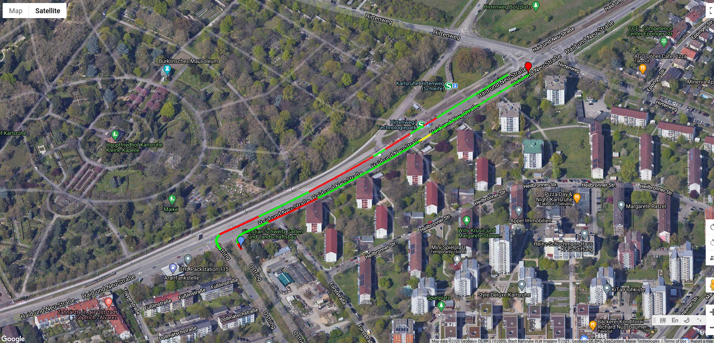
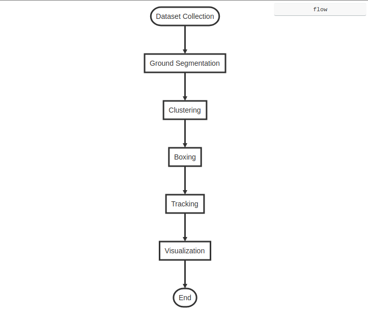

# Traffic Heatmap Generation on Top of Mapping

# Introduction
This is the coding part of the traffic heatmap. This project is to create a traffic heatmap based on the radar dataset.

# Membership
Yufeng Chen
Nitish Sanghi
Tingjun Li
Hyoensu Do
Ruochen Hou

# Basic workflow

# Instruction

## Environment

System: Ubuntu 18.04 LTS

Python 3.6 (System Interpretor)

MATLAB R2021a

bash: /bin/bash

## Prerequisite

python-pcl

Computer Vision Toolbox

Image Processing Toolbox

Sensor Fusion and Tracking Toolbox

## Execution

It can be runned by run.sh

`/bin/bash run.sh`
